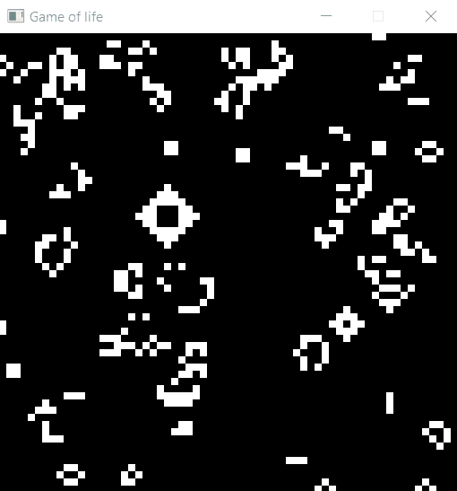
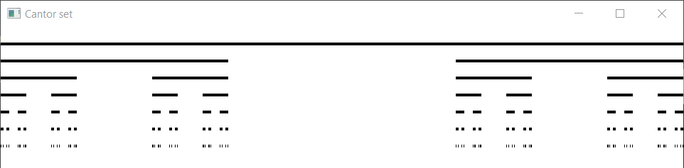
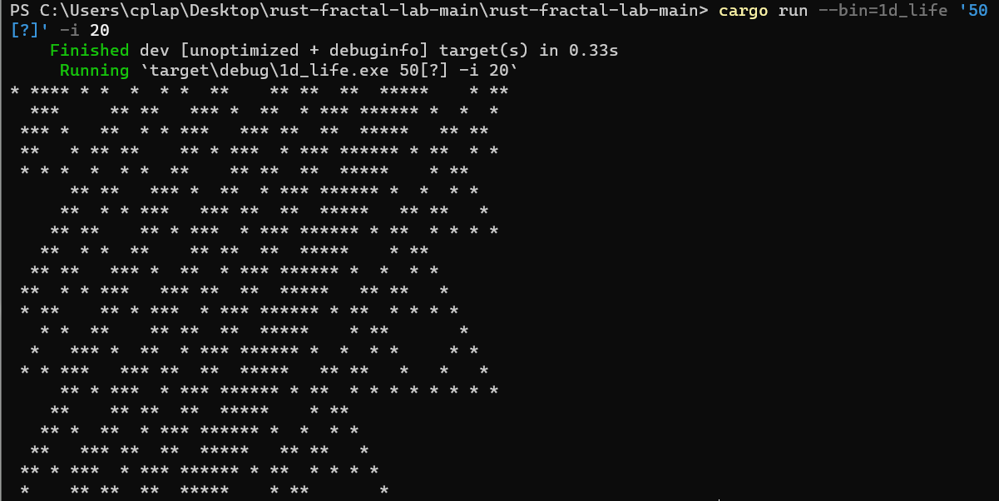
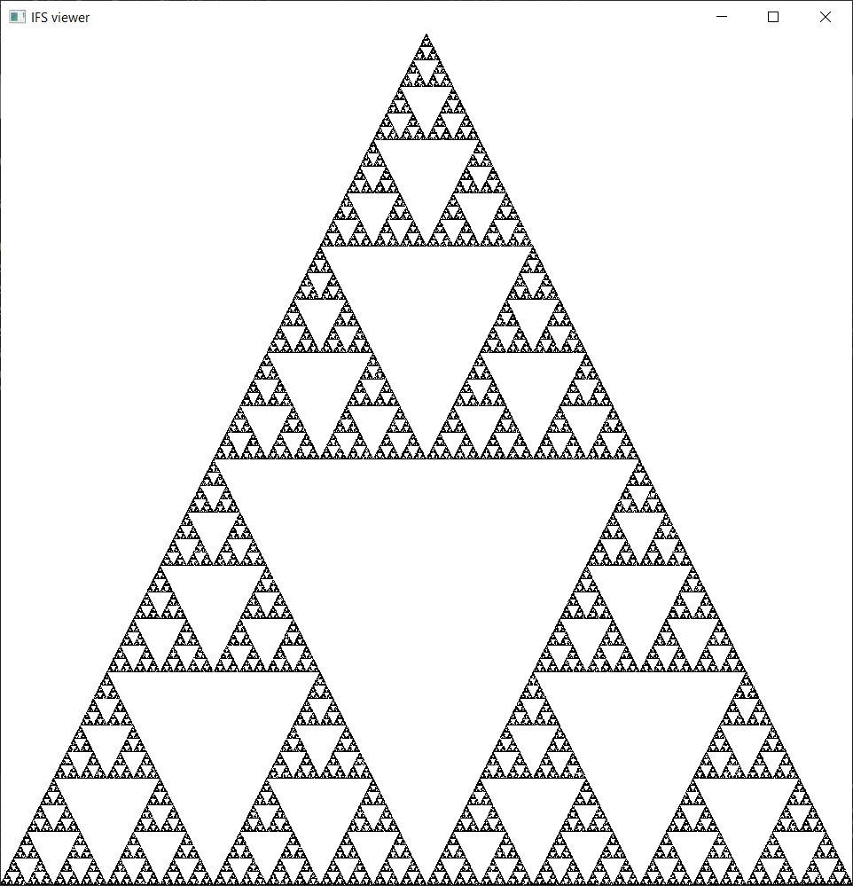

# rust-fractal-lab

This is the companion source code for ... TODO

## Screenshots

Here is a sampling of the included fractals and programs.  

### Mandelbrot / Julia set viewer
* GPU rendering; subroutines for Julia set function, color map, and color mode
* Histogram coloring algorithm
* Keyboard and mouse controls
* Separate control window with adjustable sliders
```shell
cargo run --bin=mandel_julia dragon
```


### Game of life
* Game logic runs on GPU
* Click and drag to set pixels
```shell
cargo run --bin=game_of_life
```


### Bifurcation diagram
* GPU rendering via geometry shader
* Control window with adjustable sliders
```shell
cargo run --bin=bifurcation
```


### Cantor set
* Simple recursive fractal
```shell
cargo run --bin=cantor
```


### 1D game of life
* Runs in your terminal, no GPU needed
```shell
cargo run --bin=1d_life '50[?]' -i 20
```


### Iterated function system (IFS) fractals
* Over a dozen IFS fractals to play with
```shell
cargo run --bin=sierpinski-ifs
```


```shell
cargo run --bin=redmoscl
```


## How to run

### Linux

Instructions based on Ubuntu 22.04.1.

1. Install Rust (easiest way is https://rustup.rs/)
2. Install required tools and libraries:
```shell
sudo apt install build-essential cmake libfontconfig-dev pkg-config
```

3. Clone source code and run!

```shell
git clone https://github.com/introtochaosbook/rust-fractal-lab.git
cd rust-fractal-lab
cargo run --bin=game_of_life
```

### Windows

Instructions based on Windows 10.

1. Install Rust (easiest way is https://rustup.rs/)


### macOS
