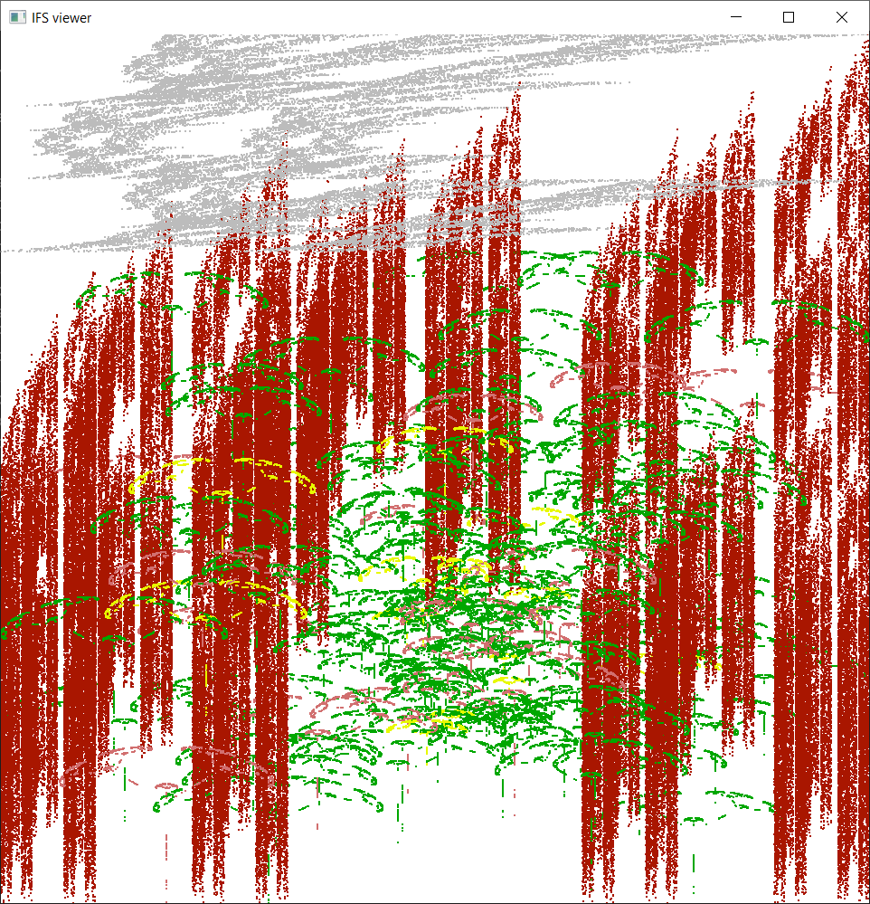

# rust-fractal-lab

This is the companion source code for the upcoming book *Introduction to Chaos, Fractals and Dynamical Systems*.

For usage instructions please scroll down to the bottom of the page.

## Screenshots

Here is a sampling of the included fractals and programs.  

### Mandelbrot / Julia set viewer
* GPU rendering; subroutines for Julia set function, color map, and color mode
* Histogram coloring algorithm
* Keyboard and mouse controls
* Separate control window with adjustable sliders
```shell
cargo run --bin=mandel_julia dragon
```


### Game of life
* Game logic runs on GPU
* Click and drag to set pixels
```shell
cargo run --bin=game_of_life
```


### Bifurcation diagram
* GPU rendering via geometry shader
* Control window with adjustable sliders
```shell
cargo run --bin=bifurcation
```


### Cantor set
* Simple recursive fractal
```shell
cargo run --bin=cantor
```


### 1D game of life
* Runs in your terminal, no GPU needed
```shell
cargo run --bin=1d_life '50[?]' -i 20
```


### Iterated function system (IFS) fractals
* Over a dozen IFS fractals to play with
```shell
cargo run --bin=sierpinski-ifs
```


```shell
cargo run --bin=redmoscl
```


## How to run

### Linux

Instructions based on Ubuntu 22.04.1.

1. Install Rust: https://rustup.rs/
2. Install required tools and libraries:
```shell
sudo apt install -y build-essential cmake git libfontconfig-dev pkg-config
```

3. Clone source code and run!

```shell
git clone https://github.com/introtochaosbook/rust-fractal-lab.git
cd rust-fractal-lab
cargo run --bin=game_of_life
```

**Note**: if you are using a virtual machine, you may have issues with OpenGL especially if you are using an older kernel version. Some things to try:
* Ensure your VM has 3D graphics acceleration enabled
* Use the [glxinfo utility](https://manpages.ubuntu.com/manpages/bionic/man1/glxinfo.1.html) to check 
* Upgrade to a newer kernel

### macOS

Instructions based on macOS Big Sur. I am using Homebrew (https://brew.sh/) as package manager.

1. Install git:
```shell
brew install git
```

2. Install rust: https://rustup.rs/
   - The installer will ask if you want to customize installation options. This is not necessary - just choose option #1.
3. Clone source code and run!

```shell
git clone https://github.com/introtochaosbook/rust-fractal-lab.git
cd rust-fractal-lab
cargo run --bin=game_of_life
```

### Windows

Instructions based on Windows 10.

1. Install git: https://git-scm.com/download/win
2. Install Rust: https://rustup.rs/
   - If the installer prompts you to install Visual C++ prerequisites, choose option #1 and let it proceed. 
   - The installer will also ask if you want to customize installation options. This is not necessary - just choose option #1 again.
3. At this point, make sure link.exe is found in your PATH. To do this, open a command prompt and type link.exe. If you get "*'link.exe' is not recognized as an internal or external command, operable program or batch file.*", then you'll need to manually add an entry to your PATH environment variable. In my case I had to add:
**C:\Program Files\Microsoft Visual Studio\2022\Community\VC\Tools\MSVC\14.34.31933\bin\Hostx64\x64**. Why couldn't the installer just have done this for me? :shrug:
4. Clone source code and run!

```shell
git clone https://github.com/introtochaosbook/rust-fractal-lab.git
cd rust-fractal-lab
cargo run --bin=game_of_life
```

**Note:** when running in a virtual machine, you may get an error like this:

```
thread 'main' panicked at 'called `Result::unwrap()` on an `Err` value: GlutinCreationError(NoAvailablePixelFormat)', src\bin\mandel_julia\main.rs:211:58
```

Unfortunately, I was unable to find a fix or workaround.
